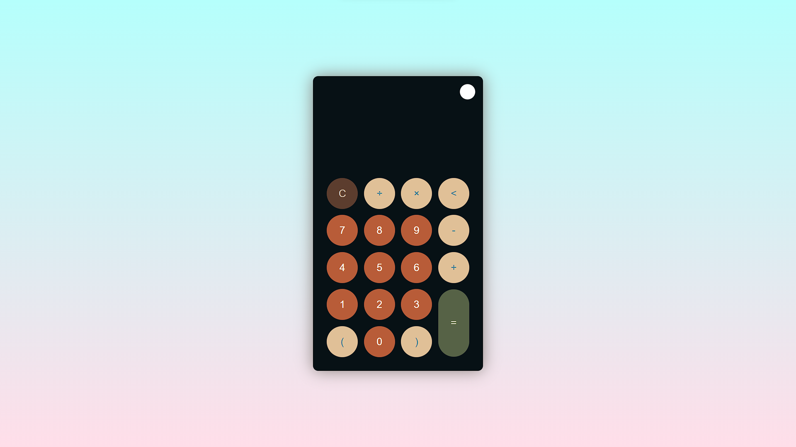
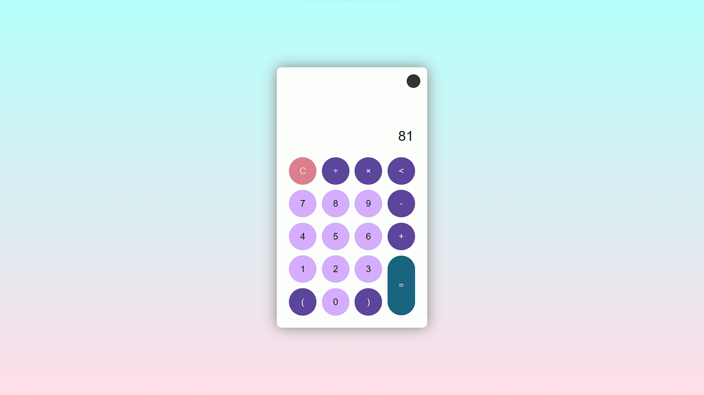

# CodSoft3
Calculator Level 1 Task 3
 
<b>Calculator</b>
This repository contains code for a calculator,
I have added <b>Dark</b> as well as <b>Light</b> mode in this calculator to enhance user experience

<b>Demo Webpage Link:</b> https://deepbhapkar.github.io/CodSoft3/

<b>Technologies Used:</b>

The PortFolio Website utilizes the following technologies:

<b>HTML</b>: Markup language for structuring the web pages.

<b>CSS</b>: Styling language for visually enhancing the UI.

<b>Javascript</b>: It enhances the interactivity and user experience of websites

Webpage looks like => 

This is a responsive web page: 

Thus Functional on<b> Mobiles</b> and<b> Tablets </b>as well.

